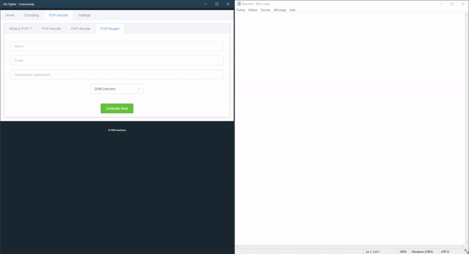

# nQcipher Community

## What is it ?
nQCipher is an Electron & Node JS crossplatform application.

Features:

- Encode & decode a sting with AES-256-CTR algorithm

- Encode & decode PGP (Pretty Good Privacy)

- Generate Public & Private PGP keys

- Stick to screen mode



## Project setup
```
npm install
```

### Compiles and hot-reloads for development
```
npm run electron:serve
```

### Compiles and minifies for production
```
npm run electron:build
```

### Run the node server (currently needed for PGP)
```
node server/main.js
```
